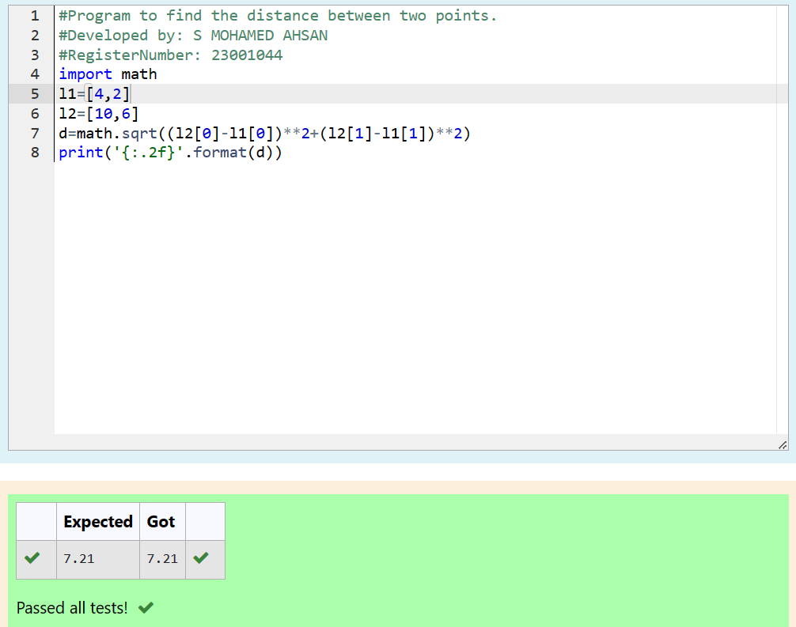

# DISTANCE-BETWEEN-TWO-POINTS

## AIM:
To write a python program to find the distance two 2 points
## ALGORITHM:
### Step 1:
Import the math module  
### Step 2: 
Define co-ordinates for which the distance is to be found
### Step 3: 
Substitute the values in the distance formula  

### Step 4: 
Display the obtained answer from the distance formula upto 2 decimal places
### PROGRAM:
~~~
#Program to find the distance between two points.
#Developed by: S MOHAMED AHSAN
#RegisterNumber: 23001044
import math
l1=[4,2]
l2=[10,6]
d=math.sqrt((l2[0]-l1[0])**2+(l2[1]-l1[1])**2)
print('{:.2f}'.format(d))
~~~  

### OUTPUT:

### RESULT:
A python program to find the distance two 2 points was successfully created.